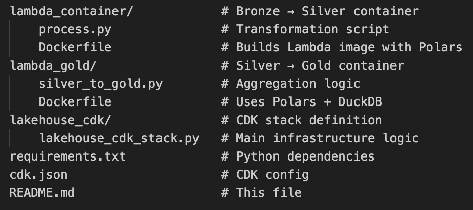
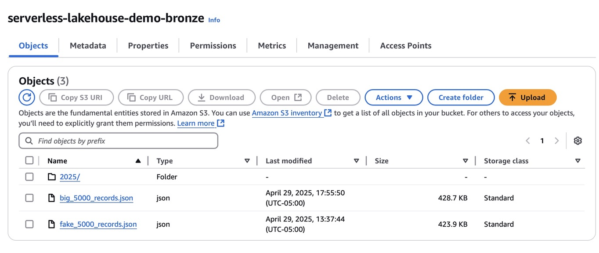
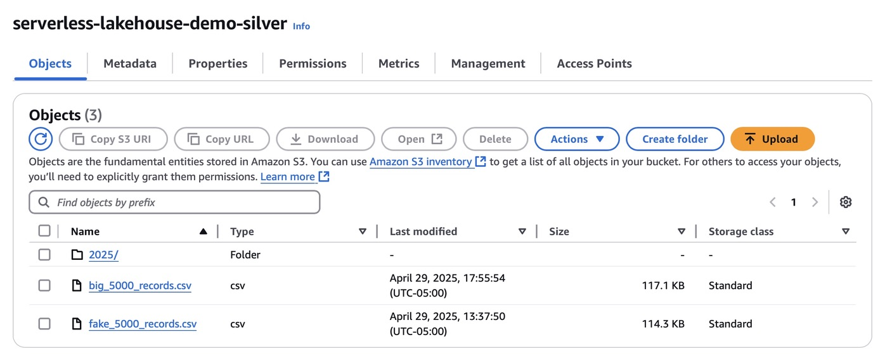
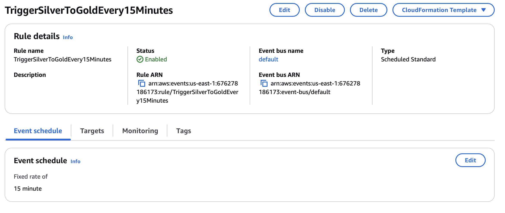
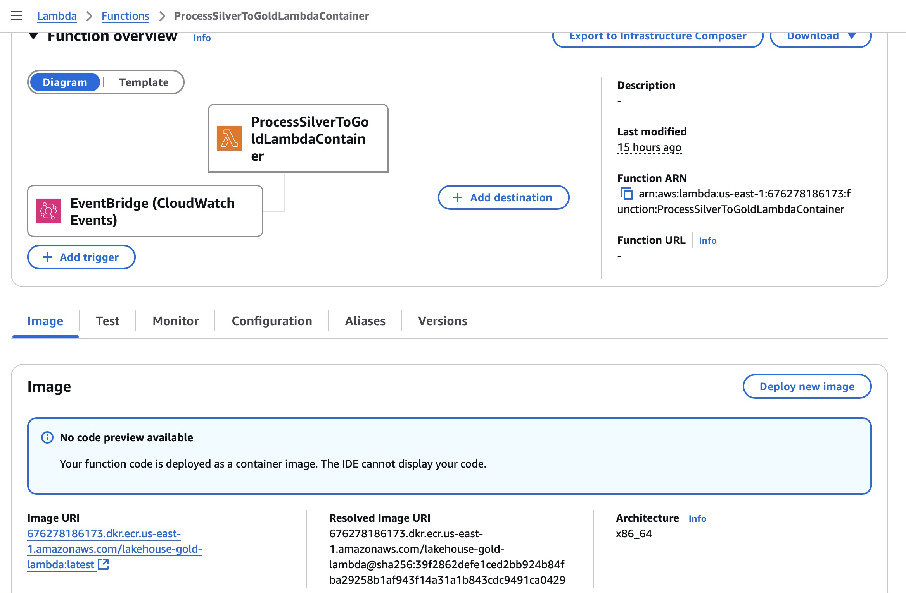
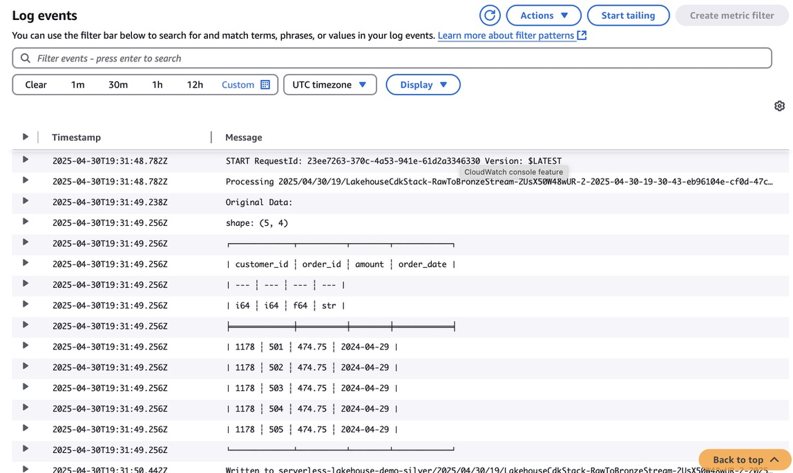
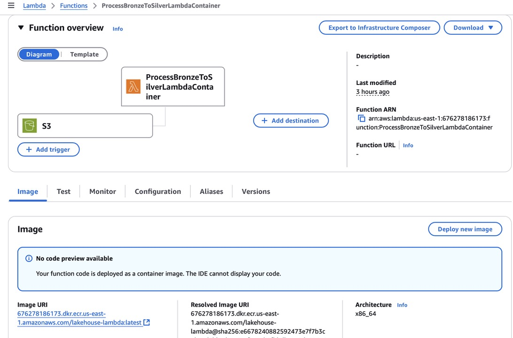
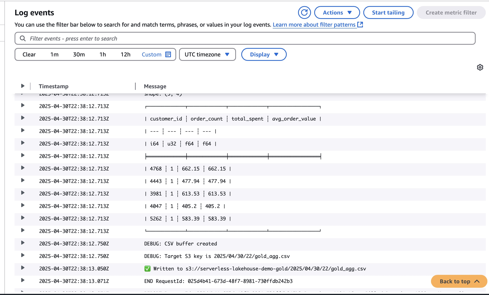
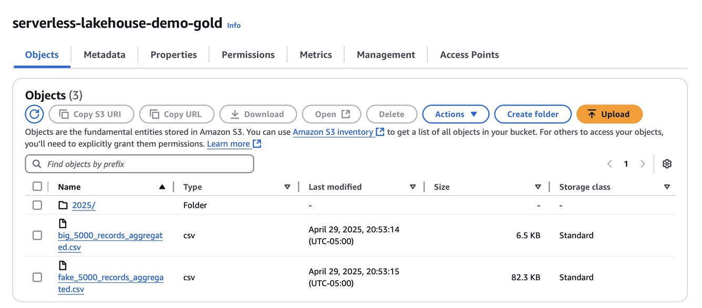
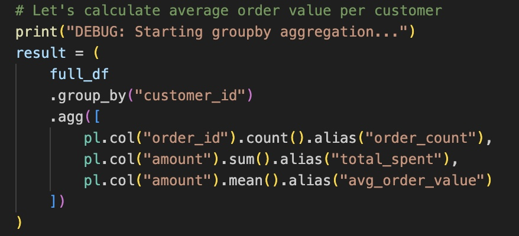

# Serverless Lakehouse on AWS using CDK, Polars

## Overview
This project demonstrates how to build a fully **serverless lakehouse** architecture on AWS using:
- **AWS CDK** for infrastructure-as-code
- **Kinesis Firehose** for real-time ingestion
- **AWS Lambda (Docker-based)** for transformations
- **Polars** and **DuckDB** for fast in-memory data processing
- **Amazon S3** as the data lake storage

We implement a classic **Bronze → Silver → Gold** data pipeline without using Apache Spark or Delta Lake (delta-rs). Instead, CSV files are used at each layer, making this lightweight and simple to manage.

---

## Architecture

- **Bronze Layer**: Raw `.json` records are pushed to S3 via Kinesis Firehose.
- **Silver Layer**: A Lambda container reads `.json` from Bronze, validates/cleans data using Polars, and writes `.csv` to Silver.
- **Gold Layer**: Another Lambda container (triggered by EventBridge every 15 min) aggregates Silver data using Polars and DuckDB and writes output to Gold in `.csv`.

---

## Tools Used

- **AWS Services**: S3, Lambda, IAM, Kinesis Firehose, EventBridge, CloudWatch, ECR
- **Compute**: Docker + Lambda Containers
- **Transformation Libraries**: Polars (faster than Pandas), DuckDB (in-memory SQL)
- **Storage Format**: CSV → Easily extendable to Delta
- **Visualization**: Power BI or AWS Athena (optional)

---

## Folder Structure

## Setup Instructions

## Create and activate virtual environment
python3 -m venv .venv
source .venv/bin/activate

## Install dependencies
pip install -r requirements.txt

## Deploy infrastructure with CDK
cdk bootstrap 
cdk deploy

## Docker Lambda Instructions (for Mac M1 & M2)

Bronze → Silver (lambda_container)

cd lambda_container
docker buildx create --name lakehouse-builder --use || echo "Builder exists"
docker buildx build --platform linux/amd64 -t lakehouse-lambda . --load
docker tag lakehouse-lambda:latest 676278186173.dkr.ecr.us-east-1.amazonaws.com/lakehouse-lambda:latest
docker push 676278186173.dkr.ecr.us-east-1.amazonaws.com/lakehouse-lambda:latest

Silver → Gold (lambda_gold)

cd ../lambda_gold
docker buildx build --platform linux/amd64 -t lakehouse-gold-lambda . --load
docker tag lakehouse-gold-lambda:latest 676278186173.dkr.ecr.us-east-1.amazonaws.com/lakehouse-gold-lambda:latest
docker push 676278186173.dkr.ecr.us-east-1.amazonaws.com/lakehouse-gold-lambda:latest

## Update Lambda Functions

aws lambda update-function-code \
  --function-name ProcessBronzeToSilverLambdaContainer \
  --image-uri 676278186173.dkr.ecr.us-east-1.amazonaws.com/lakehouse-lambda:latest

aws lambda update-function-code \
  --function-name ProcessSilverToGoldLambdaContainer \
  --image-uri 676278186173.dkr.ecr.us-east-1.amazonaws.com/lakehouse-gold-lambda:latest

## Set Environment Variables

aws lambda update-function-configuration \
  --function-name ProcessBronzeToSilverLambdaContainer \
  --environment "Variables={BRONZE_BUCKET=serverless-lakehouse-demo-bronze,SILVER_BUCKET=serverless-lakehouse-demo-silver}"

aws lambda update-function-configuration \
  --function-name ProcessSilverToGoldLambdaContainer \
  --environment "Variables={SILVER_BUCKET=serverless-lakehouse-demo-silver,GOLD_BUCKET=serverless-lakehouse-demo-gold}"

## Ingest Sample Records

for i in {1..10}; do
  echo "{\"customer_id\": $((RANDOM % 1000 + 1000)), \"order_id\": $((500 + i)), \"amount\": $((RANDOM % 500 + 50)).75, \"order_date\": \"2024-04-29\"}" \
  | base64 | xargs -I {} aws firehose put-record \
    --delivery-stream-name <your-firehose-name> \
    --record '{"Data":"{}"}'
done

## Manual Lambda Testing 

aws lambda invoke \
  --function-name ProcessBronzeToSilverLambdaContainer \
  --payload '{}' \
  response.json && cat response.json

aws lambda invoke \
  --function-name ProcessSilverToGoldLambdaContainer \
  --payload '{}' \
  response.json && cat response.json

## SnapShots

